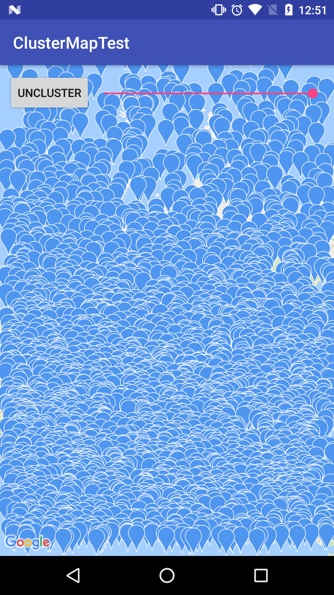
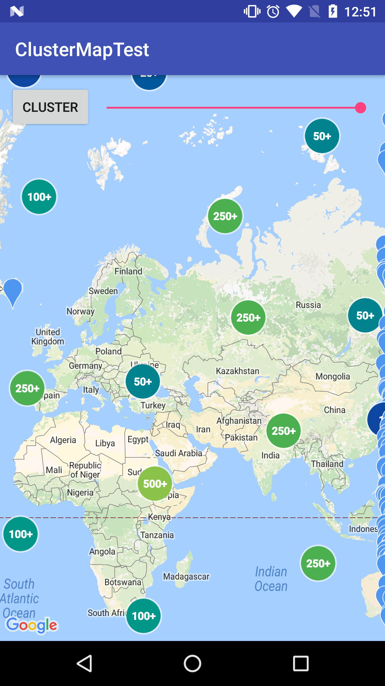

FCluster
==

It is an clustering extension of the google map for android.
More than 50,000 marker are renderable for the sake of its clustering.

Comparison
--
please compare belows and select which library is the best for you.

Official map utility

https://developers.google.com/maps/documentation/android-api/utility/marker-clustering

Other opensource map utility

https://github.com/mg6maciej/android-maps-extensions


License
--
Apache License 2.0

https://www.apache.org/licenses/LICENSE-2.0


Screenshot
--
before cluster



after cluster


How to use
--
```
public class MainActivity extends AppCompatActivity implements 
    OnMapReadyCallback, 
    FClusterAdapter.ClusterListener,
    FClusterAdapter.InfoWindowListener {

    private MyClusterAdapter mAdapter;

    private class MyClusterAdapter extends FClusterAdapter {

        private MyClusterAdapter(Handler uiHandler, GoogleMap map, int density) {
            super(uiHandler, map, density);
        }

        @Override
        public MarkerOptions newClusterOption(FCluster cluster) {
            // should create marker options;
            return null;
        }

        @Override
        public MarkerOptions newMarkerOption(FClusterItem item) {
            // should create marker options;
            return null;
        }

        @Override
        public CircleOptions newCircleOption(FClusterItem item) {
            // should create circle options;
            return null;
        }

        @Override
        public PolylineOptions newPolylineOption(FClusterItem item) {
            // should create polyline options;
            return null;
        }

        @Override
        public PolygonOptions newPolygonOption(FClusterItem item) {
            // should create polygon options;
            return null;
        }

        @Override
        public boolean shouldCluster() {
            return mShouldCluster;
        }
    }

    @Override
    public void onClickClister(FCluster cluster) {
        Log.d("FCluster", "cluster clicked."+cluster.getSize());
    }

    @Override
    public void onClickClisterItem(FClusterItem item) {
        Log.d("FCluster", "cluster item clicked."+item.getMarker().getTitle());
    }

    @Override
    public void onClickInfoWindow(FClusterItem item) {
        Log.d("FCluster", "cluster item info window clicked."+item.getMarker().getTitle());
    }

    @Override
    public void onClickInfoWindow(FCluster cluster) {
        Log.d("FCluster", "cluster info window clicked."+cluster.getSize());
    }

    private class MyInfoWindowAdapter implements GoogleMap.InfoWindowAdapter {
        @Override
        public View getInfoWindow(Marker marker) {
            return getInfoContents(marker);
        }

        @Override
        public View getInfoContents(Marker marker) {
            final View root = LayoutInflater.from(getApplicationContext()).inflate(R.layout.layout_info_window, null);
            final TextView tvTitle = (TextView)root.findViewById(R.id.title_text);
            final TextView tvSnippet = (TextView)root.findViewById(R.id.snippet_text);

            final Object tag = mAdapter.getMarkerTag(marker);
            if (tag instanceof FCluster) {
                final FCluster cluster = (FCluster)tag;
                final StringBuilder sb = new StringBuilder();
                sb.append("cluster size:"+cluster.getSize());
                sb.append("\n");
                for (FClusterItem item : cluster.getClusterItems()) {
                    final Sample sample = (Sample) item.getTag();
                    sb.append(sample.title);
                    sb.append("\n");
                }
                tvTitle.setText(sb);
            } else if (tag instanceof FClusterItem) {
                FClusterItem item = (FClusterItem)tag;
                if (item.getTag() instanceof Sample) {
                    final Sample sample = (Sample) item.getTag();
                    tvTitle.setText(sample.title);
                    tvSnippet.setText(sample.snippet);
                }
            }
            return root;
        }
    }


    @Override
    public void onMapReady(GoogleMap googleMap) {
        // configure google map

        int density = getResources().getDimensionPixelSize(R.dimen.cluster_density);
        mAdapter = new MyClusterAdapter(new Handler(Looper.getMainLooper()), googleMap, density);
        mAdapter.setClusterListener(this);
        mAdapter.setInfoWindowAdapter(new MyInfoWindowAdapter(), this);
        setRandomData(100);
    }

```
